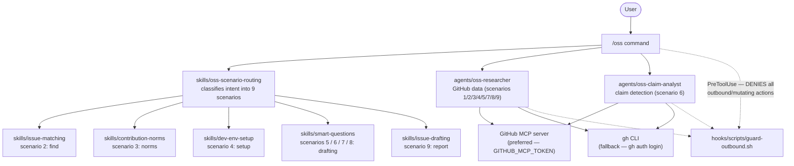

# agentic-contributor Documentation

Research-and-engagement assistant for contributing to open-source projects — draft-only, human-in-the-loop.

## Overview

The `agentic-contributor` plugin is the research-and-drafting half of a two-plugin system for OSS contributions. It handles everything up to—but not including—the actual send/post/push: it fetches live GitHub data, classifies your intent, and produces ready-to-review drafts. A separate execution/submission plugin (using `gh` CLI) performs the actual actions after you approve a draft.

The plugin exposes a single `/oss` command that routes to one of 9 contribution scenarios. A `PreToolUse` guardrail hook actively denies all outbound and mutating actions at the tool level, so the draft-only contract is enforced regardless of how the agents are used.

## Component Diagram

## Quick Links

### Getting Started

- [Installation](getting-started/installation.md) — install, enable, authenticate, validate
- [Quick Start](getting-started/quick-start.md) — first `/oss` walkthrough

### Guides

- [Using /oss](guides/using-oss.md) — all 9 scenarios in depth with examples
- [GitHub Access](guides/github-access.md) — MCP server vs `gh` CLI, token setup, rate limits

### Concepts

- [Draft-Only Guardrail](concepts/draft-only-guardrail.md) — what the hook blocks, why deny, hand-off to execution plugin
- [Two-Plugin System](concepts/two-plugin-system.md) — research half vs execution half, the hand-off boundary

### Reference

- [Commands](reference/commands.md) — `/oss` frontmatter, arguments, behavior steps
- [Agents](reference/agents.md) — `oss-researcher` and `oss-claim-analyst` specs
- [Skills](reference/skills.md) — all 6 skills with trigger phrases
- [Hooks](reference/hooks.md) — guardrail registration and full deny/allow matrix
- [Scenarios](reference/scenarios.md) — canonical 9-scenario table with full detail

---

Back to [README](https://github.com/josix/agentic-contributor/blob/main/README.md) | [CHANGELOG](https://github.com/josix/agentic-contributor/blob/main/CHANGELOG.md)
